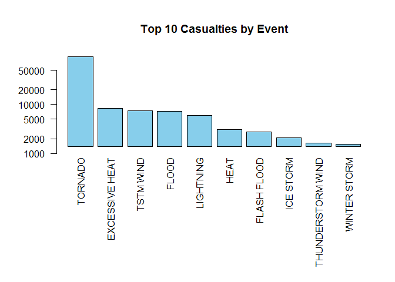
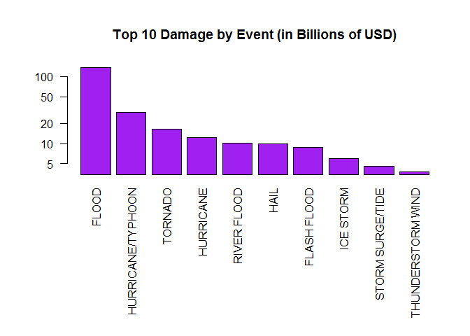

# 1950 - 2011 Storm Data Top Casualties and Damages
diebugger  
Saturday, April 25, 2015  

## Abstract
Analyzing the data collected by NOAA during the period 1950-2011, about different atmospheric events, we want to extract relevant information about the most hurting and expensive events. First, we will go through all necessary steps in order to subset and sort data in a format suitable to our analysis. Then, results are exposed in graphic format and there will be shown the Top 10s events per number of casualties and per billions of US dollars of property and land damage.

## Data Processing
First of all, we want to list the packages used in this analysis, for the sake of reproducibility:


```r
# includes
library("knitr")
library("lubridate")
library("dplyr")
library("ggplot2")
```

Then, we need to load the data in a dataframe structure. Data are available from this [website](https://d396qusza40orc.cloudfront.net/repdata%2Fdata%2FStormData.csv.bz2) in a BZ2 compressed file that we can extract like this:


```r
# load dataset
StormData <- read.csv(bzfile("repdata-data-StormData.csv.bz2", "rt"))
```

The details about the file's content are described in [this PDF document](https://d396qusza40orc.cloudfront.net/repdata%2Fpeer2_doc%2Fpd01016005curr.pdf). Reading across documentation, we found there's no "casualties" variable, so we created this by summing "fatalities" and "injuries":


```r
# add sum of population damages and group by event type
StormData <- StormData %>% group_by(EVTYPE) %>% mutate(POP_HEALTH_DMG = sum(INJURIES, FATALITIES)) 

# subset for ease of use
PopDmg <- StormData[, c(8,38)]
PopDmgByEvType <- PopDmg[!duplicated(PopDmg),]
PopDmgByEvType <- PopDmgByEvType[order(PopDmgByEvType$POP_HEALTH_DMG, na.last = T, decreasing = T),]
```

We also want to clean up the "damage" variables, because there are a lot of typos and not formatted values: in doing so, we considered as valid only columns with value magnitude clearly stated - "K for thousands, "M" for millions and "B" for billions.


```r
# subset data for ease of use
PropertyDmg <- StormData[, c(8, 25:28)]
PropertyDmg <- PropertyDmg[
  (PropertyDmg$PROPDMGEXP %in% c("K", "k", "B", "b", "M", "m") 
   & PropertyDmg$CROPDMGEXP %in% c("K", "k", "B", "b", "M", "m"))
  ,]
```

As code suggests, we have shrunk the datasets to the minimum useful variables.  

In order to get the real amount of dollars for each event's damage, we normalized every value to the billion of dollars by mean of the following function:


```r
GetDamageInBillions <- function (val, mag) {
  for (i in 1:length(mag)) {
    if (mag[i] == "K" | mag[i] == "k")
      val[i] <- val[i] / 1000000
    if (mag[i] == "M" | mag[i] == "m")
      val[i] <- val[i] / 1000
  }
  return(val)
}
```

Calling the function on the dataset and rewriting the expenses: 


```r
# calculate the correct damage amount value based on marked magnitude (K, M, B)
PropertyDmg$PROPDMG <- GetDamageInBillions(PropertyDmg$PROPDMG, PropertyDmg$PROPDMGEXP)
PropertyDmg$CROPDMG <- GetDamageInBillions(PropertyDmg$CROPDMG, PropertyDmg$CROPDMGEXP)
```

Similarly as done for the population health damage, we want to sum up all kind of material damage in one single value, grouped by event type:


```r
# drop unused variables (3,5)
PropertyDmg <- PropertyDmg[, c(1, 2, 4)]

# make sum of damage by event type and order by sum desc
PropertyDmg <- PropertyDmg %>% group_by(EVTYPE) %>% mutate(DMGSUM = sum(PROPDMG, CROPDMG))
PropertyDmg <- PropertyDmg[order(PropertyDmg$DMGSUM, na.last = T, decreasing = T), ]

# shrink dataset and remove duplicates
PropertyDmgByEvType <- PropertyDmg[, c(1, 4)]
PropertyDmgByEvType <- PropertyDmgByEvType[!duplicated(PropertyDmgByEvType), ]
```

## Results
As first result of the above analysis, we got the 10 most harmful events:


```r
# adjust labels and margins
par(las = 2)
par(mar = c(12,5,5,2))
# 1. Across the United States, which types of events (as indicated in the EVTYPE variable) are most harmful with respect to population health?
barplot(
  PopDmgByEvType$POP_HEALTH_DMG[1:10], 
  main = "Top 10 Casualties by Event", 
  names.arg = PopDmgByEvType$EVTYPE[1:10], 
  col = "skyblue", 
  log = "y"
)
```

 

This clearly states that Tornados are the most dangerous events: if we want to save lot of lives, we should focus on preventing tornados casualties.  
  
The second result shows the 10 most expensive events in terms of property and crop damages:


```r
# adjust labels and margins
par(las = 2)
par(mar = c(12,5,5,2))
# 2. Across the United States, which types of events have the greatest economic consequences?
barplot(
  PropertyDmgByEvType$DMGSUM[1:10], 
  main = "Top 10 Damage by Event (in Billions of USD)", 
  names.arg = PropertyDmgByEvType$EVTYPE[1:10], 
  col = "purple", 
  log = "y"
)
```

 

Here, Floods make the biggest damages to the land, followed by Hurricanes and Tornados.
